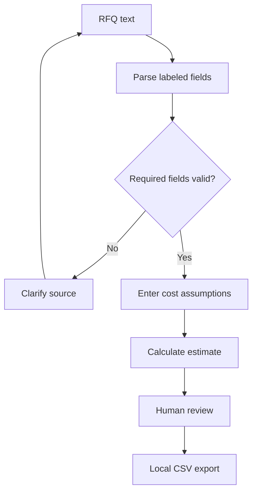
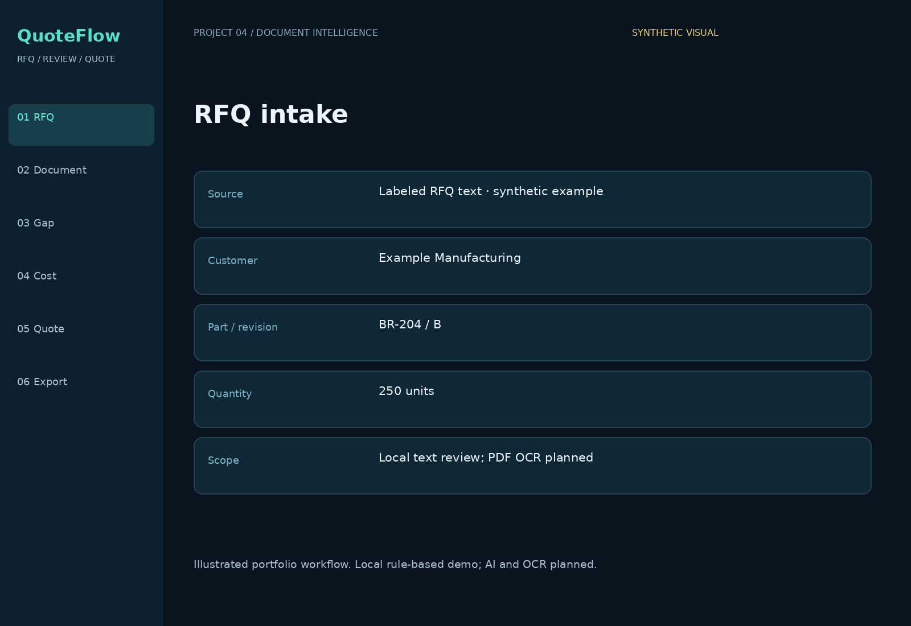
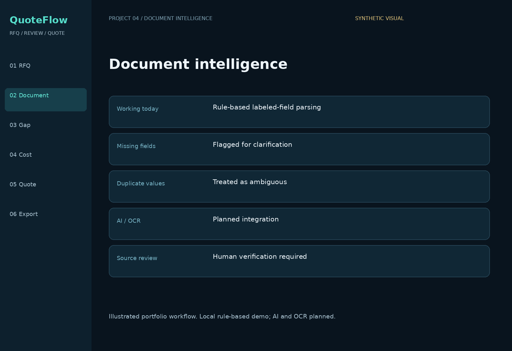
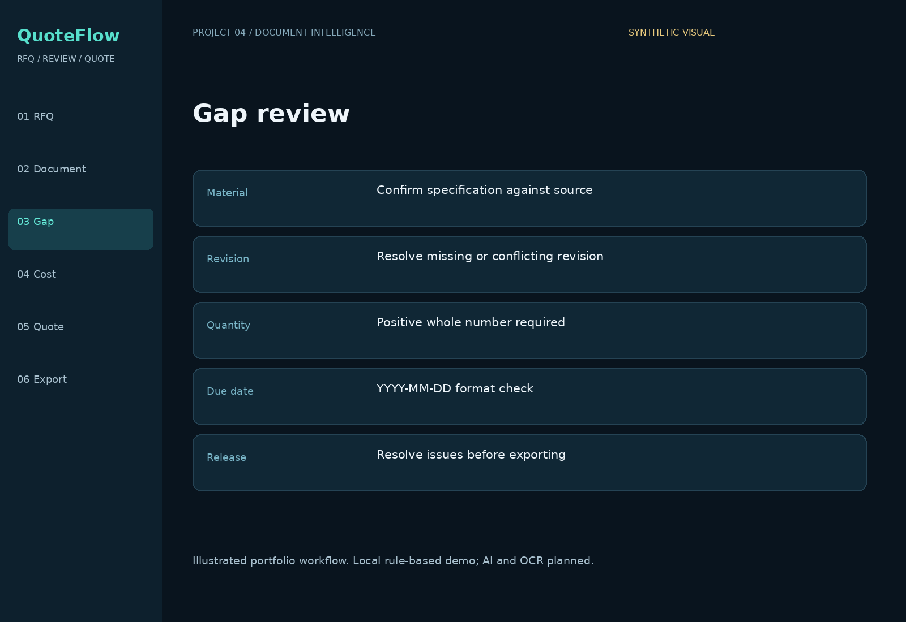
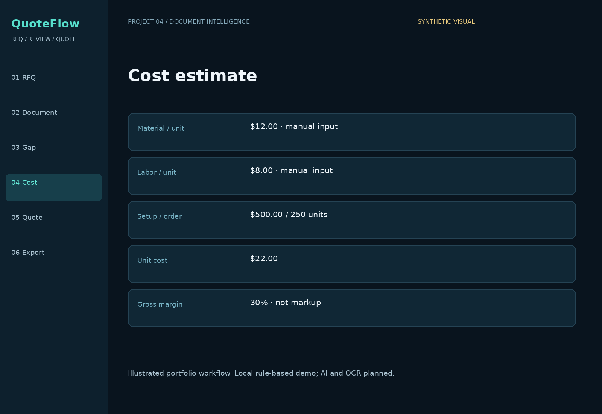
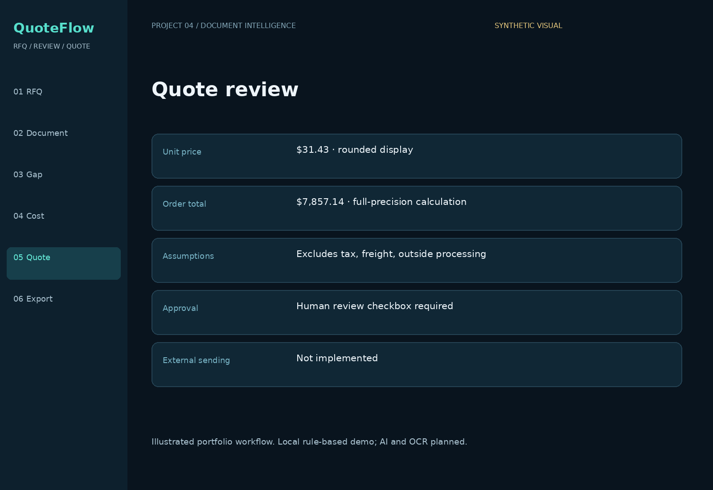
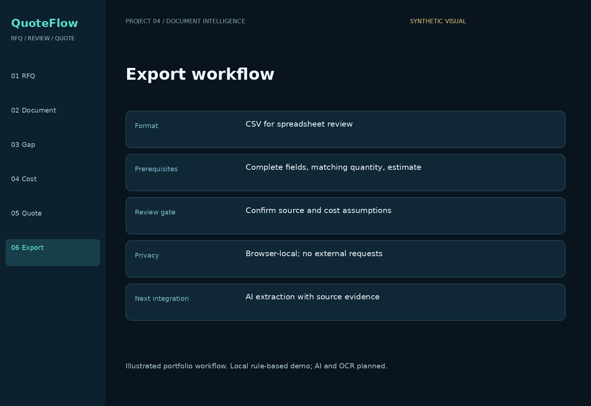

# QuoteFlow — AI-Assisted Quoting & Document Intelligence

**Federico Veneziano · Portfolio Project #4**

An RFQ-to-quote workflow prototype that turns labeled request text into a reviewable record, flags incomplete information, calculates a cost-based estimate, and exports a reviewed CSV.

## Business problem
RFQs arrive with inconsistent information. Missing revisions, quantities, and specifications create clarification work and increase the risk of quoting against the wrong assumptions. QuoteFlow demonstrates a structured review before a quote moves forward.

## Working features
- Parse six labeled fields from pasted RFQ text.
- Flag missing fields, duplicate values, invalid quantities, and incorrect date format.
- Calculate unit cost, gross-margin selling price, and order total from manual inputs.
- Require complete fields, matching quantities, and human review before local CSV export.
- Keep all demo data within the browser.

## Implementation boundaries
| Capability | Status |
|---|---|
| Labeled text parsing and gap flags | Implemented locally with deterministic rules |
| Manual costing and gross-margin calculation | Implemented |
| Human review and CSV export | Implemented locally |
| LLM document extraction and confidence scoring | Planned |
| PDF OCR and engineering drawing interpretation | Planned |
| ERP/CRM integration, live prices, quote sending | Planned |

The AI-assisted architecture is a design direction. **This version makes no LLM calls and does not extract PDFs or interpret drawings.** It contains synthetic data and illustrative portfolio visuals. No measured savings or production use is claimed. The demo checks date format but does not validate calendar dates or delivery feasibility.

## Run locally
Open `demo/index.html` in a browser. No installation or account needed. Paste the supplied example, review it, calculate a quote, confirm human review, and export a CSV. Reloading resets the demo.

## Calculation example
Material $12/unit + labor $8/unit + $500 setup / 250 units = **$22/unit cost**. At 30% gross margin: $22 / (1 − 0.30) = **$31.43 displayed unit price**. Total is calculated before rounding: **$7,857.14**. Tax, freight, outside processing, and additional tooling are excluded unless incorporated into manual costs.

## Workflow

## Portfolio visuals
These are illustrated workflow views using synthetic data, rather than live application screenshots.

### RFQ intake

### Document intelligence

### Gap review

### Cost estimate

### Quote review

### Export workflow

## Repository guide
- `demo/index.html`: runnable local demo.
- `src/rfq.js`: parsing, calculation, and CSV helpers.
- `examples/sample-rfq.txt`: synthetic input.
- `prompts/document-extraction.md`: proposed AI extraction prompt.
- `docs/case-study.md`: business approach and measurement plan.
- `docs/architecture.md`: implemented and proposed architecture.
- `tests/rfq.test.cjs`: automated checks for parsing and calculation.

Run automated checks with `node tests/rfq.test.cjs` (Node.js required for testing only).

## Skills demonstrated
Manufacturing quoting logic · workflow design · document review · cost analysis · input validation · human approval gates · applied AI architecture.
